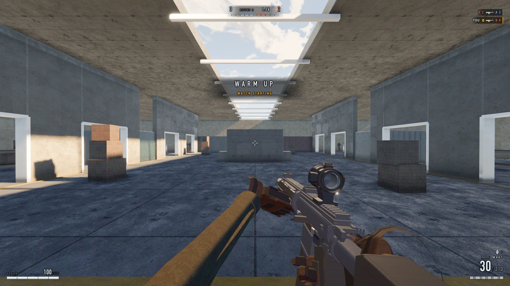

# SUDDEN DEFENCE

A round-based team elimination FPS that runs in a browser tab. WebGL2 and
Three.js r185, eight fighters by default, no netcode — and **not one art asset**. Every
texture, mesh, animation and sound in the screenshot below is generated at load
time from code.



```bash
npm install
npm run dev
```

`three` is the only dependency. Nothing is fetched at runtime — no CDN, no
HDRIs, no model files, no audio files. The game runs with the network cable out.

---

## Three JavaScript engines simulate this world bit for bit

That is the part worth reading about, and it was not free.

The question is the one that picks a netcode architecture. If two engines agree,
peers can exchange **commands** and each re-simulate — a few bytes per tick. If
they disagree, that design is dead on arrival, because divergence compounds and
lockstep has no reconciliation step. IEEE 754 pins `+ - * /` and `sqrt` to a
correctly-rounded result everywhere, but it leaves the transcendentals
implementation-approximated: `sin`, `cos`, `atan2`, `exp`, `pow`, `acos` — and
`hypot`, which surprises people because it sits next to `sqrt` in the docs. V8,
SpiderMonkey and JavaScriptCore implement those differently, so where they
differ is where two players on two machines would.

`tools/crossengine.mjs` drives the same fixed steps in all three and compares
the simulation state as **bit patterns**, not as numbers — a tolerance there
would hide exactly the last-bit disagreement the tool exists to find.

It read `190/1777 leaves differ` when it was first built. It now reads:

```
chromium vs chromium#control   IDENTICAL   (3600 ticks)
chromium vs firefox            IDENTICAL   (3600 ticks)
chromium vs webkit             IDENTICAL   (3600 ticks)
```

Thirty seconds of driven combat — two deaths, ragdolls settling, grenades in
flight at the dump — across four seeds. The route there was five rounds of
substitution, each one made only after a measurement **convicted** a specific
call site:

| | what it was | how it was found |
|---|---|---|
| 1 | `hypot(x,y,z)` respelt as `sqrt(x*x+y*y+z*z)` | the audit's own text: that spelling is correctly rounded everywhere, so 84 call sites were never part of the "permanent tax" the header warned about |
| 2 | fdlibm `atan2` ported into `dmath.js` | webkit's residue was `targetYaw`, and `atan2` has no cheap respelling |
| 3 | `dsin` `dcos` `dexp` `dlog` `dpow` `dtan` everywhere in the sim | **fifteen leaves did not move.** Bit-identical divergence across five substitution generations — which acquitted every one of our call sites |
| 4 | `dquatFromEuler` over three.js's internals | the door was a grenade in flight, thrown from a posed bone; `setFromEuler` calls the engine's own `Math.sin` *inside the library* |
| 5 | `group.rotation.y = yaw` → `dquatFromEuler` | a seed sweep, not a code review. Seed 1 broke agreement on corpses only |

Row 3 is the one to notice. "We changed it and nothing moved" was not a failed
fix — it was the evidence that ruled out everything we controlled and pointed
inside the library.

`dmath.js` keeps the rule that produced this: **a function is ported when a
measurement convicts it**, and every function in it was.

---

## Everything is generated

No `assets/` directory, because there is nothing to put in one.

- **Materials** — procedural PBR bakes: albedo, roughness, normal, AO, plus
  grime, dust and wear layers. Concrete, metal, cloth, skin, glass.
- **The level** — a 48 × 36 m warehouse, 20,152 triangles in 17 draw calls,
  built from a parametric kit of walls, windows, doors, shopfronts, stairs and
  damage. 1,164 triangles of collision under a BVH.
- **The soldiers** — skinned characters assembled from a part library (helmet,
  plate carrier, pouches, boots, goggles) over a 25-bone rig, with animation
  clips synthesised rather than authored.
- **The weapons** — three, modelled from a shared parts vocabulary: optics,
  receivers, furniture, barrels, magazines.
- **The sky** — physical atmosphere with a time of day, volumetrics, and an IBL
  probe the whole scene lights from.
- **The sound** — synthesised. Weapon reports, foley, impacts, spatialisation
  and reverb, generated in the audio graph.

Render path: HDR, 4×2048 CSM shadows, TAA, GTAO, SSR, motion blur, and a
tone-mapped composite. Over 840 frames it holds **zero stalls and zero heap
growth** — "allocate nothing per frame" is a hard rule here, and the profiler
measures it rather than trusting it.

The median frame rate is deliberately not quoted as a number here. It is a
property of the machine at least as much as of the code: `tools/profile.mjs`
records the same commit measuring p50 57 fps and p50 13 fps within an hour, and
spending a day catching a security agent rather than a regression. Recent runs
on the reference laptop sit between 49 and 62 fps at dpr 2, with the frame
render-bound — 19.7 ms of a 20.4 ms frame is `render.render`, and no simulation
phase clears the reporting threshold. Run `npm run test:perf` on hardware you
control and believe that instead.

---

## The gates

Forty-two files live in `tools/` (two are shared libraries), and thirty are gates that `npm test`
runs. Almost none of them are unit tests. They ask questions about the
*experience*, because that is what can actually break:

| gate | the question |
|---|---|
| `friendfoe` | can you tell which team a man belongs to before he shoots you? |
| `legibility` | is an enemy body readable against the wall behind it? |
| `symmetry` | is the map actually fair? |
| `phasecue` | can a player tell that the round phase just changed? |
| `converge` | two survivors, no line of sight — how long until they find each other? |
| `firerate` | does the rate of fire depend on the frame rate? |
| `debris` | does anything stay in the air after the round has gone? |
| `roundreset` | does a new round hand back a full magazine — and the grenades? |
| `vault` | can a bot vault into solid geometry? |
| `reach` | can alpha actually walk to bravo? |
| `replay` | snapshot a tick, run on, restore, replay — same state? |
| `crossengine` | do three JavaScript engines simulate the same world? |
| `netsim` | do two independently booted sims agree, bit for bit, with no netcode? |
| `pixelgate` | did this commit change the picture, and did anyone mean it? |

```bash
npm test              # all 30
npm run test:logic    # 22 that read engine state only — no pixels, no timing
npm run test:render   # the ones that sample the framebuffer or compare bits
npm run test:perf     # frame time and stalls; wants an idle machine
```

`test:render` and `test:perf` are pinned to the reference machine, and they say
so instead of going red elsewhere. Pixel hashes are hashes of a *renderer*, and
a gate that cries wolf on a different GPU is a gate people learn to skip.

### The thresholds have reasons, and the reasons are written down

`profile`'s stall ceiling was 250 ms and is now 100 ms. The commit explains why:
the first thrown grenade cost 122–142 ms on about one run in four, and **every
occurrence passed the 250 ms gate while being plainly visible to play**. A bound
set at the size of the worst bug you happened to measure is a bound that only
ever catches that bug again.

`compiledDuringPlay` is required to be exactly `0`. It was bounded at 1 while
the job was unfinished, and the bound is 0 now because a residue nobody can
attribute is precisely what a bound of 1 lets back in.

---

## Deliberate omissions

Ported from a Call-of-Duty-style sandbox and then cut back on purpose:

**No ADS.** Hipfire only; accuracy is a spread model, not a sight picture.
**Deterministic spray.** A fixed seeded recoil pattern you can memorise, and one
you have to pull down against: the climb is on the aim, so it moves the round.
Bob, breath and trauma shake are *not* — those move the camera and nothing else,
and `tools/aim.mjs` gates the difference. **Hitscan.** No travel
time, no drop. **No sprint, slide, mantle, lean or prone** — stand, crouch,
jump, and that is the whole movement vocabulary. **No health regen.** Damage is
permanent for the round. **Headshots are lethal**, and the player carries the
same part capsules a bot does. **No respawns** — death is final until the round
ends, and you spectate a living team-mate over the shoulder rather than free-cam
through walls.

A minimap was deleted too, along with a compass. A 48 × 36 m symmetric depot
with three lanes is a map you learn in two rounds; a minimap of it is a second
screen showing what the first already does.

---

## Working on it

`ARCHITECTURE.md` is the contract, and it is worth reading before touching
anything. The short version:

1. You own your directory. Subsystems never import each other — they meet at
   runtime through `ctx.get(id)`. This is what let 31k lines of engine move here
   from another project untouched.
2. The engine layer (`render`, `materials`, `sky`, `physics`, `fx`, `audio`,
   `core`) may never *name* gameplay. When it needs something gameplay knows,
   gameplay pushes it down.
3. No `Math.random()` — `ctx.rng`, or a fork you keep.
4. Allocate nothing per frame.
5. `npm run build` passes and `node tools/capture.mjs --shot=boot` produces a
   frame, or nobody else can work.

## Licence

ISC — see [LICENSE](LICENSE).
