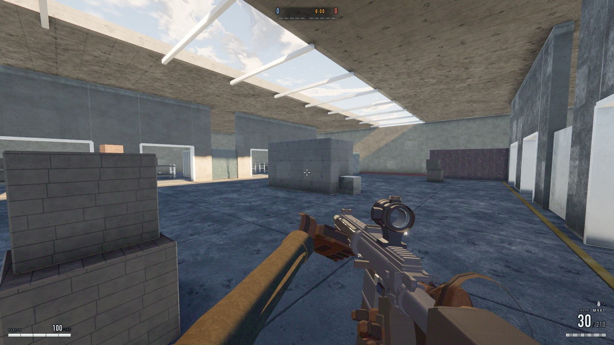

# sudden-claude

A round-based team elimination FPS that runs in a browser tab. First to five
rounds, best of nine. Four fighters a side — you and three bots against four —
in one mirrored warehouse. WebGL2 and Three.js, and nothing else.


```bash
npm install
npm run dev        # http://127.0.0.1:5173
```

| | | | |
|---|---|---|---|
| move | `WASD` | reload | `R` |
| look / fire | mouse | throw | `G` |
| jump | `Space` | weapons | `1` `2` `3`, `Q` to swap |
| crouch | `Ctrl` / `C` | fire mode | `B` |
| scoreboard | `Tab` | pause | `Esc` |

No sprint, no ADS, no lean, no slide. Accuracy is the hipfire cone plus a recoil
pattern you learn to pull down; the crosshair lives in the HUD.

---

## No assets

There is no `assets/` directory. Every texture, mesh, animation, material and
sound in the screenshot above is generated at load time — the concrete, the
hazard stripes, the rifle, the gloves on the hands holding it, the soldiers, the
sky.



The repository contains 183 JavaScript files and one runtime dependency:

```json
"dependencies": { "three": "^0.180.0" }
```

That constraint is a hard rule rather than a boast (see
[ARCHITECTURE.md](ARCHITECTURE.md)), and it is why the game runs offline, boots
without a loading bar, and diffs as text.

## Three JavaScript engines agree, bit for bit

This is the part worth reading about.

The question was which netcode is available. If two engines simulate the same
world identically, peers can exchange *commands* — a few bytes per tick — and
each re-simulate. If they don't, that design is dead on arrival, because
divergence compounds and lockstep has no reconciliation step.

That is not a preference. It is a measurement, and `tools/crossengine.mjs` makes
it. Today, across Chromium (V8), Firefox (SpiderMonkey) and Safari
(JavaScriptCore), 3600 ticks, four recorded seeds:

```
CROSSENGINE IDENTICAL
```

Getting there took three rounds of work, and the shape of it is the interesting
part. IEEE 754 pins `+ - * /` and `sqrt` to a correctly-rounded result. It does
**not** pin the transcendentals: `sin`, `cos`, `atan2`, `exp`, `pow`, `acos` are
"implementation-approximated" in the spec, and every engine is free to be
slightly different.

1. **The control was noise.** The first run read 190 differing leaves out of
   1777 — until it turned out two browsers were building *different worlds*,
   because the engine drew its master seed from `Math.random()`. With `?seed=`
   and `?lockstep=1` the control went to zero, and the real number was **one**
   leaf: `ai.agents[2].s.animator.phase`.

2. **`hypot` was the cheap half.** It sits among the approximated functions in
   the spec, but `hypot(x, y, z)` is `sqrt(x² + y² + z²)` up to overflow
   handling, and that spelling is correctly rounded everywhere. 84 call sites
   re-spelled in `src/core/dmath.js`, and Firefox went identical.

3. **The rest was fdlibm.** `sin`, `cos` and `atan2` were ported from fdlibm so
   every engine evaluates the same polynomial. The last holdout was inside
   Three.js — `Quaternion.setFromEuler` calls the engine's own trig, so the root
   yaw of every agent had to be routed through the ported versions too.

`tools/replay.mjs` gates the other half of the same property: snapshot a tick,
replay the same commands, arrive at bit-identical state. And
`tools/headless.mjs` boots the simulation with no renderer at all, which is what
makes a server an option rather than a rewrite.

No netcode is implemented. What exists is the evidence that either architecture
would work, and the seams — `ctx.commands.override`, `captureState` /
`restoreState` on six subsystems — for whichever gets chosen.

## Gates, not unit tests

40 harnesses live in `tools/`; 21 of them run in `npm test`. Almost none of them
assert that a function returns a value. They measure whether the game
*perceives* and *behaves* correctly, from inside a real browser:

| | |
|---|---|
| `legibility` | can you tell a soldier from the wall — and from clutter — at 24 m? |
| `friendfoe` | is the team mark separable from the enemy's at 9 m? |
| `ballistics` | how many rounds does a kill take, and does the spray pattern climb? |
| `kick` | how far does the *view* move — the number `ballistics` cannot see¹ |
| `botfight` | do bots actually kill each other, and is every death attributed? |
| `matchsim` | do five rounds complete, with the right winners and no drift? |
| `vault` | does every accepted vault have headroom to land in? |
| `reach` | is the floor one connected region with no free sightline at the bell? |
| `aim` | do bob, breath and shake move the camera without moving the round? |
| `firerate` | is the printed RPM the RPM you get at 30 and at 144 fps? |
| `debris` | does anything stay in the air after the round has gone? |
| `pixelgate` | did the picture change without the manifest changing? |
| `determinism` | are two capture passes byte-identical? |
| `crossengine` | do three JS engines simulate the same world? |
| `layering` | did anyone break the architecture's hard rules? |

¹ `kick` reports and does not gate. Feel is a judgement, and a threshold on it
would be a threshold on somebody's taste — what the tool is for is making a
change to that taste visible, so the argument happens over four figures instead
of two adjectives. It earned its place immediately: `ballistics` had been
reporting 15.4° of recoil climb for the M4A1 by summing the pattern array, while
the view actually moved 1.18° over ten rounds *and 1.18° over twenty-eight*. The
spray had no shape at all, and the design comments, the documentation and the
gate all agreed with each other about a mechanic no player was ever subject to.

```bash
npm test              # everything
npm run test:logic    # headless + simulation gates, no GPU opinion
npm run test:render   # pixels, determinism, cross-engine
npm run test:perf     # frame time; run it on hardware you control
```

The split matters: `test:logic` asks questions whose answer is a property of the
**code**, and `test:render` and `test:perf` ask questions whose answer is partly
a property of the **machine**. Only the first belongs on a shared CI runner.

Several of these were written because something had already gone wrong and
nothing had caught it. `pixelgate` exists because a material-slot ordering defect
shipped and survived: the only tool that compared against a *stored* picture was
wired to nothing, and `determinism` passes happily when both passes are equally
wrong.

## Layout

```
src/
  core/       engine, registry, fixed-step clock, RNG, command stream, dmath
  render/     depth prepass, cascaded shadows, GTAO, SSR, TAA, bloom, exposure
  materials/  procedural material library and its GLSL
  sky/        atmosphere
  physics/    swept capsules, rigid bodies, ragdolls, penetration
  fx/         particles, decals, impacts
  audio/      Web Audio synthesis — not one audio file in the project
  world/      the warehouse and its kit of parts
  player/     movement, camera rig, health
  weapons/    three guns, viewmodel, ballistics
  ai/         bots — perception, cover, combat
  ui/         HUD
  match/      rounds, teams, scoring
  dev/        named camera poses and the deterministic frame pump
tools/        the harnesses above
```

Thirteen subsystems, each owning one directory, none importing another's
modules. They find each other at runtime through a registry. That rule is what
let 31k lines of engine code move here from another project untouched, and
`tools/layering.mjs` enforces it on every run.

[ARCHITECTURE.md](ARCHITECTURE.md) is the contract — read it before writing code.

## License

ISC. See [LICENSE](LICENSE).
